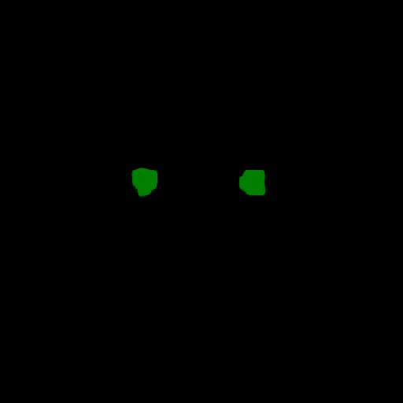
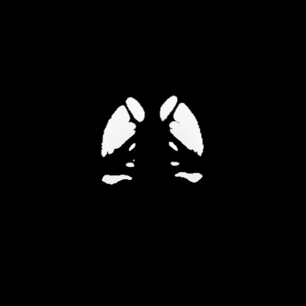

<h2>Tensorflow-Image-Segmentation-Brain-MRI-PD25 (2024/11/21)</h2>

This is the first experiment of Image Segmentation for Brain-MRI-PD25 
 based on 
the latest <a href="https://github.com/sarah-antillia/Tensorflow-Image-Segmentation-API">Tensorflow-Image-Segmentation-API</a>, and
 <a href="https://drive.google.com/file/d/1CqmTRRnLa6IZ9x0LTqHGLNEsytQg7Vjh/view?usp=sharing">
Brain-MRI-PD25-ImageMask-Dataset.zip</a>, which was derived by us from  
which was derived by us from <b>sub-PD25</b> of  
<a href="https://openneuro.org/datasets/ds002016/versions/1.0.0">
<b>OpenNEURO BigBrainMRICoreg</b>
</a>
  
On BreaDM.zip dataset, please see also:<a href="https://github.com/smallboy-code/Breast-cancer-dataset">Breast-cancer-dataset</a> 

 

<b>Actual Image Segmentation for Images of 512x512 pixels</b> 
As shown below, the inferred masks look similar to the ground truth masks.  

<table>
<tr>
<th>Input: image</th>
<th>Mask (ground_truth)</th>
<th>Prediction: inferred_mask</th>
</tr>
<tr>
<td></td>
<td></td>
<td></td>
</tr>

<tr>
<td></td>
<td></td>
<td></td>
</tr>

<tr>
<td></td>
<td></td>
<td></td>
</tr>
</table>

 
In this experiment, we used the simple UNet Model 
<a href="./src/TensorflowUNet.py">TensorflowSlightlyFlexibleUNet</a> for this Brain-MRI-PD25Segmentation Model. 
As shown in <a href="https://github.com/sarah-antillia/Tensorflow-Image-Segmentation-API">Tensorflow-Image-Segmentation-API</a>.
you may try other Tensorflow UNet Models: 

<li><a href="./src/TensorflowSwinUNet.py">TensorflowSwinUNet.py</a></li>
<li><a href="./src/TensorflowMultiResUNet.py">TensorflowMultiResUNet.py</a></li>
<li><a href="./src/TensorflowAttentionUNet.py">TensorflowAttentionUNet.py</a></li>
<li><a href="./src/TensorflowEfficientUNet.py">TensorflowEfficientUNet.py</a></li>
<li><a href="./src/TensorflowUNet3Plus.py">TensorflowUNet3Plus.py</a></li>
<li><a href="./src/TensorflowDeepLabV3Plus.py">TensorflowDeepLabV3Plus.py</a></li>

 

<h3>1. Dataset Citation</h3>
The original dataset used here has been taken from the web site: 
<a href="https://openneuro.org/datasets/ds002016/versions/1.0.0">
<b>OpenNEURO BigBrainMRICoreg</b>
</a>
  
<b>Authors:</b> 
Yiming Xiao, Jonathan C. Lau, Taylor Anderson, Jordan DeKraker, D. Louis Collins,  
Terry M. Peters, Ali R. Khan 
 
<b>README:</b> 
This dataset includes co-registration of the BigBrain dataset to the MNI PD25 atlas and 
the ICBM152 2009b atlases. The data include deformed BigBrain atlases and manual 
subcortical segmentations in MINC2 and NIFTI-1 formats, as well as relevant spatial transformation 
in MINC transformation format. The segmented subcortical structures include: red nucleus, 
subthalamic nucleus, substantia nigra, caudate, putamen, globus pallidus externa, globus pallidus 
interna, thalamus, hippocampus, nucleus accumbens, and amygdala
 
Note that the described improved co-registration was performed upon the BigBrain data in ICBM space
 from the BigBrain 2015release.
  
<b>License:</b> CC BY4.0 

Within this dataset, the down-sampled versions of BigBrain atlases are distributed under 
the CC BY4.0 License upon the consent from the original data owners, 
the Montreal Neurological Institute (Montreal, Canada) and the Forschungszentrum Jülich (Jülich, Germany). 
However, this exception to the existing BigBrain dataset does not alter the general term of that license 
for use of the BigBrain itself, which is still under the CC BY-NC-SA 4.0 License.

 

 
<h3>
<a id="2">
2 Brain-MRI-PD25 ImageMask Dataset
</a>
</h3>
 If you would like to train this Brain-MRI-PD25 Segmentation model by yourself,
 please download the dataset from the google drive  
<a href="https://drive.google.com/file/d/1CqmTRRnLa6IZ9x0LTqHGLNEsytQg7Vjh/view?usp=sharing">
Brain-MRI-PD25-ImageMask-Dataset.zip</a>,
, expand the downloaded ImageMaskDataset and put it under <b>./dataset</b> folder to be
<pre>
./dataset
└─Brain-MRI-PD25
    ├─test
    │   ├─images
    │   └─masks
    ├─train
    │   ├─images
    │   └─masks
    └─valid
        ├─images
        └─masks
</pre>
On the derivation of this dataset, please refer to
<a href="./generator/ImageMaskDatasetGenerator.py">
ImageMaskDatasetGenerator.py</a>, and <a href="./generator/split_master.py">split_master.py.</a> 
This is a samll pre-augmented dataset generated by the generator.
 
 
<b>Brain-MRI-PD25 Statistics</b> 
 
 
As shown above, the number of images of train and valid datasets is not enough to use for a training set of our segmentation model.
 
 
<b>Train_images_Ssample</b> 

 
<b>Train_masks_sample</b> 

 

<h3>
3 Train TensorflowUNet Model
</h3>
 We have trained Brain-MRI-PD25TensorflowUNet Model by using the following
<a href="./projects/TensorflowSlightlyFlexibleUNet/Brain-MRI-PD25/train_eval_infer.config"> <b>train_eval_infer.config</b></a> file.  
Please move to ./projects/TensorflowSlightlyFlexibleUNet/Brain-MRI-PD25and run the following bat file. 
<pre>
>1.train.bat
</pre>
, which simply runs the following command. 
<pre>
>python ../../../src/TensorflowUNetTrainer.py ./train_eval_infer.config
</pre>

<b>Model parameters</b> 
Defined a small <b>base_filters</b> and large <b>base_kernels</b> for the first Conv Layer of Encoder Block of 
<a href="./src/TensorflowUNet.py">TensorflowUNet.py</a> 
and a large num_layers (including a bridge between Encoder and Decoder Blocks).
<pre>
[model]
base_filters   = 16
base_kernels   = (7,7)
num_layers     = 8
dilation       = (1,1)
</pre>

<b>Learning rate</b> 
Defined a small learning rate.  
<pre>
[model]
learning_rate  = 0.0001
</pre>

<b>Online augmentation</b> 
Disabled our online augmentation.  
<pre>
[model]
model         = "TensorflowUNet"
generator     = False
</pre>

<b>Loss and metrics functions</b> 
Specified "bce_dice_loss" and "dice_coef". 
<pre>
[model]
loss           = "bce_dice_loss"
metrics        = ["dice_coef"]
</pre>
<b>Learning rate reducer callback</b> 
Enabled learing_rate_reducer callback, and a small reducer_patience.
<pre> 
[train]
learning_rate_reducer = True
reducer_factor     = 0.4
reducer_patience   = 4
</pre>

<b>Early stopping callback</b> 
Enabled early stopping callback with patience parameter.
<pre>
[train]
patience      = 10
</pre>

<b>Epoch change inference callbacks</b> 
Enabled epoch_change_infer callback. 
<pre>
[train]
epoch_change_infer       = True
epoch_change_infer_dir   =  "./epoch_change_infer"
epoch_changeinfer        = False
epoch_changeinfer_dir    = "./epoch_changeinfer"
num_infer_images         = 6
</pre>

By using this callback, on every epoch_change, the inference procedure can be called
 for 6 images in <b>mini_test</b> folder. This will help you confirm how the predicted mask changes 
 at each epoch during your training process.    

<b>Epoch_change_inference output</b> 
 
 

In this experiment, the training process was stopped at epoch 92  by EarlyStopping Callback.  
 
 

<a href="./projects/TensorflowSlightlyFlexibleUNet/Brain-MRI-PD25/eval/train_metrics.csv">train_metrics.csv</a> 
 

 
<a href="./projects/TensorflowSlightlyFlexibleUNet/Brain-MRI-PD25/eval/train_losses.csv">train_losses.csv</a> 
 

 

<h3>
4 Evaluation
</h3>
Please move to a <b>./projects/TensorflowSlightlyFlexibleUNet/Brain-MRI-PD25</b> folder, 
and run the following bat file to evaluate TensorflowUNet model for Brain-MRI-PD25. 
<pre>
./2.evaluate.bat
</pre>
This bat file simply runs the following command.
<pre>
python ../../../src/TensorflowUNetEvaluator.py ./train_eval_infer_aug.config
</pre>

Evaluation console output: 

  Image-Segmentation-Brain-MRI-PD25

<a href="./projects/TensorflowSlightlyFlexibleUNet/Brain-MRI-PD25/evaluation.csv">evaluation.csv</a> 

The loss (bce_dice_loss) to this Brain-MRI-PD25/test was low, but dice_coef not so high as shown below.
 
<pre>
loss,0.0837
dice_coef,0.8583
</pre>
 

<h3>
5 Inference
</h3>
Please move to a <b>./projects/TensorflowSlightlyFlexibleUNet/Brain-MRI-PD25</b> folder 
,and run the following bat file to infer segmentation regions for images by the Trained-TensorflowUNet model for Brain-MRI-PD25. 
<pre>
./3.infer.bat
</pre>
This simply runs the following command.
<pre>
python ../../../src/TensorflowUNetInferencer.py ./train_eval_infer_aug.config
</pre>

<b>mini_test_images</b> 
 
<b>mini_test_mask(ground_truth)</b> 
 

<b>Inferred test masks</b> 
 
 

<b>Enlarged images and masks </b> 

<table>
<tr>
<th>Image</th>
<th>Mask (ground_truth)</th>
<th>Inferred-mask</th>
</tr>

<tr>
<td></td>
<td></td>
<td></td>
</tr>

<tr>
<td></td>
<td></td>
<td></td>
</tr>

<tr>
<td></td>
<td></td>
<td></td>
</tr>
<tr>
<td></td>
<td></td>
<td></td>
</tr>
<tr>
<td></td>
<td></td>
<td></td>
</tr>
<tr>
<td></td>
<td></td>
<td></td>
</tr>
</table>

 

<h3>
References
</h3>
<b>1. BigBrainMRICoreg</b> 

<a href="https://openneuro.org/datasets/ds002016/versions/1.0.0">
https://openneuro.org/datasets/ds002016/versions/1.0.0
</a>
 
Yiming Xiao, Jonathan C. Lau, Taylor Anderson, Jordan DeKraker, D. Louis Collins, Terry M. Peters, Ali R. Khan 
Dataset DOIdoi:10.18112/openneuro.ds002016.v1.0.0 
 

<b>2. An accurate registration of the BigBrain dataset with the MNI PD25 and ICBM152 atlases</b> 
Yiming Xiao, Jonathan C. Lau, Taylor Anderson, Jordan DeKraker, D. Louis Collins, Terry Peters, Ali R. Khan 

<a href="http://dx.doi.org/10.1038/s41597-019-0217-0">http://dx.doi.org/10.1038/s41597-019-0217-0</a>
 

